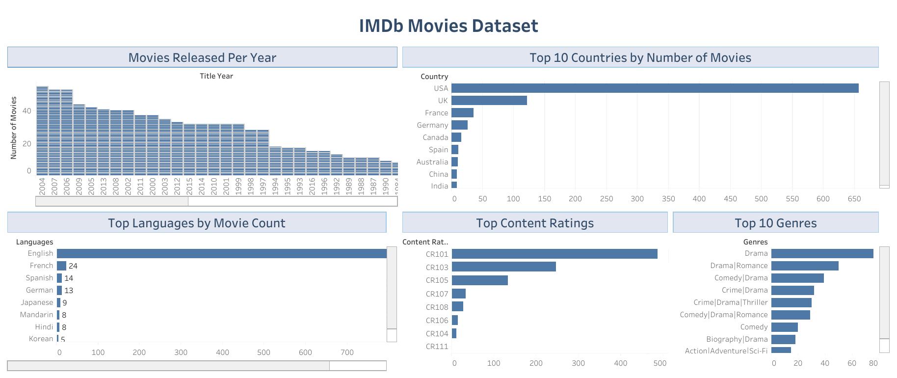

# IMDb Movie Analysis Dashboard

This project explores an IMDb movie dataset using SQL for analysis and Tableau for visualization.  
The goal is to understand trends in movie releases, genres, languages, ratings, and countries.

## Dashboard Preview

## Tools Used
- SQL
- Tableau
- IMDb dataset

## Analysis Performed
- Movies released per year
- Top 10 countries by number of movies
- Top languages by movie count
- Content rating distribution
- Top movie genres

## SQL Queries
The SQL analysis used in this project is available in:
- `imdb_sql_analysis.sql`

## How to Open
Open the Tableau file:
- `Movie Analysis Dashboard.twbx`

## Author
Bushra Mohib
